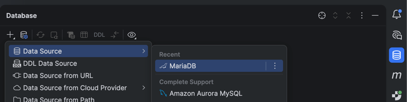

# Prerequisites
Before running this project, make sure you install docker desktop on your machine.
https://www.docker.com/products/docker-desktop/

# How to run
run the following command in the root directory of the project:

```
docker-compose up
```

Connect to the database from Intellij:



Connect to the database using the following credentials: root and root. Download the drivers if needed.


Check the connection and then apply if the connection is successful.


Right click on the database and click on new -> Query Console. Copy paste the sql scripts from resources. First create.sql and then insert.sql.